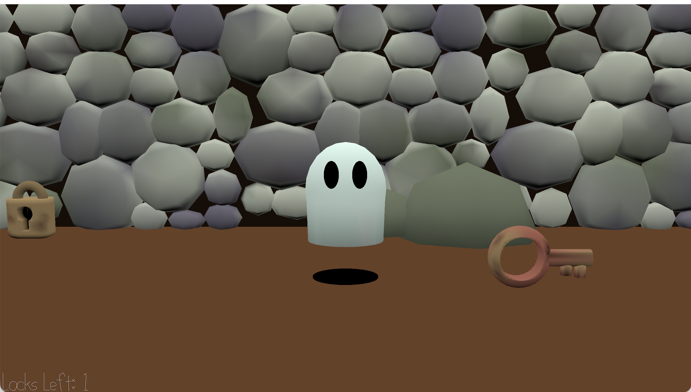

# Ghost Escape

Author: Sarah Garland (sgarlan2)

Design: Match keys to locks by matching pitch and escape the dungeon. 

Screen Shot:

Background music [BeepBox Link](https://www.beepbox.co/#9n31s7k2l07e09t22a7g0ij08r1i0o432T1v3u01f0q8z20k3123132d09AcFhBcQ0358P8888E1bfT1v1u01f0q0x10j41d19AbF8B7Q0471Peb9aE2b676T5v3u05f0qwx20n514212d08H-IHyiih9999998h0E1b6T3v1ugaf0qwx10i611d08SarABJSSSSSRJIAzE1b6bu94zhkl5hkl6p4gic30Mc30M4mli4Qh4h4h1cy0000000000000p23XIR_BFekQuD8liarnUpJvJGFJvo1uCzUA96hbYKCU_MCR-qSq_Dqq_xstf1gexjniqZ5mACzWFArd8qbVdoLHKsvgMCLmN5YLSGjzWW-jqGPnNwwWqpVuPbxib892PzQOZyR2RyRyVt2RSrIU-ChqXclPbPagKpxKwkQuKLxOeKALHHHH8UxKpEYaFTXCz-GHGELQzKVKoPr2e-ALJHHHdunQ4td9HQQCLeDPK-OGefDjVh7os69UmCzbds0)

How To Play:

- `WASD` - move 
- `Space` - listen to key/lock
- `M` - mute/unmute background music
- `Q` - pickup/drop a key
- `E` - use key on lock

This game was built with [NEST](NEST.md).
